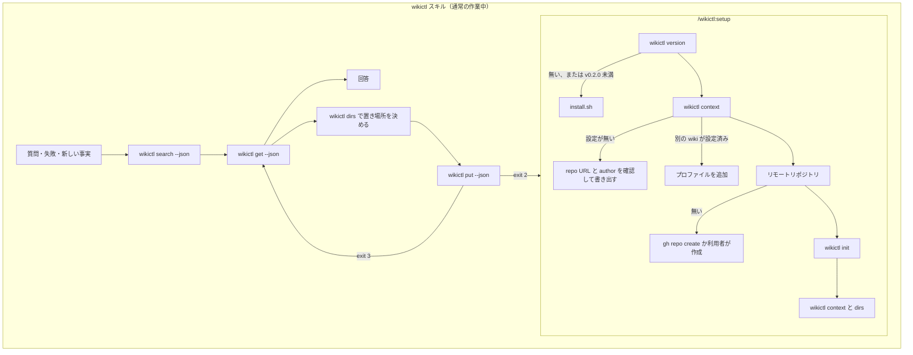

# wikictl-claude-plugin

[English](README.md)

Claude Code から [wikictl](https://github.com/roamer7038/wikictl) で Markdown wiki を参照・記録するためのプラグイン。中身はスキル 2 つだけで、フック・MCP・スクリプトはありません。

## 導入

Claude Code 内で:

    /plugin marketplace add roamer7038/wikictl-claude-plugin
    /plugin install wikictl@wikictl-claude-plugin

その後 `/wikictl:setup` を一度実行します。開発中は `claude --plugin-dir /path/to/wikictl-claude-plugin`。

wikictl v0.2.0 以降が必要です。`/wikictl:setup` で導入・更新できます。

## 構成

```
.claude-plugin/
  plugin.json          プラグインのマニフェスト
  marketplace.json     マーケットプレイスのマニフェスト（このリポジトリ自身がマーケットプレイス）
skills/
  wikictl/SKILL.md     ページの参照と記録。Claude が自分の判断で使う
  setup/SKILL.md       wikictl の導入・更新、設定、wiki の作成。/wikictl:setup で実行
```

## フロー



## スキル

### wikictl

いつ wiki を見るか、どう読み書きするかを Claude に伝えます。

- 環境固有の値、利用者の規約、過去の判断や規則を答える前、コマンドが失敗したとき、新しいページを書く前に読む。
- 作業で再利用できる事実が得られたら書く。会話の要約と手順（スキル）は書かない。毎回の会話で守る規則は、wiki ではなく CLAUDE.md への追加を提案する。
- 既存ページは `put --base <sha>` で更新し、終了コード 3 なら読み直して変更を再適用する。
- 置き場所は `projects/<name>/`、`machines/<name>/`、`personal/`、`global/` のうち最も狭いもの。ディレクトリを作る前に `wikictl dirs` を見て、各ディレクトリに `index.md` を置き、ページから `part_of` で結ぶ。

書式の細則は `wikictl help` と wikictl の README に委ね、スキルには判断に必要なことだけを書いています。

### setup

導入を順に進め、確認が通る段階は飛ばします。バイナリ（wikictl のリリースから `install.sh`。古い版の更新にも使う）、設定ファイル（リポジトリ URL と `claude-code@<hostname>` のような author。別の wiki が設定済みならプロファイルを追加）、リモートリポジトリ（`gh` があれば `gh repo create`）、`wikictl init`、最後に `wikictl context` と `wikictl dirs`。インストール・書き込み・push を伴う段階は毎回利用者に確認します。引数にリポジトリ URL を渡すと質問を省けます: `/wikictl:setup git@github.com:you/wiki.git`。

## ライセンス

[MIT](LICENSE)
