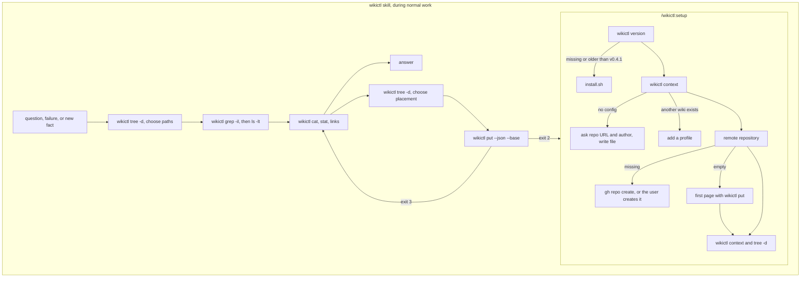

# wikictl-claude-plugin

[日本語版](README.ja.md)

A Claude Code plugin that lets Claude read and record knowledge in a Markdown wiki through [wikictl](https://github.com/roamer7038/wikictl). It contains two skills and nothing else: no hooks, no MCP server, no scripts.

## Install

Inside Claude Code:

    /plugin marketplace add roamer7038/wikictl-claude-plugin
    /plugin install wikictl@wikictl-claude-plugin

Then run `/wikictl:setup` once. For local development: `claude --plugin-dir /path/to/wikictl-claude-plugin`.

Requires wikictl v0.4.1 or later; `/wikictl:setup` installs or updates it.

## Structure

```
.claude-plugin/
  plugin.json          plugin manifest
  marketplace.json     marketplace manifest (this repository is its own marketplace)
skills/
  wikictl/SKILL.md     read and record pages; Claude invokes it on its own
  setup/SKILL.md       install or update wikictl, write the config, write the first page; run as /wikictl:setup
```

## Flow



## Skills

### wikictl

Tells Claude when to consult the wiki and how to read and write pages:

- Read before answering with environment-specific values, the user's conventions, past decisions or rules, when a command fails, and before writing a new page.
- wikictl does not choose directories from the current directory, so the skill has Claude look at `wikictl tree -d` and pass the matching `global`, `personal`, `projects/<name>` and `machines/<name>` to `grep -il --all-match -e <word> -e <word>`, then choose pages by `summary` from `ls -lt`. When nothing answers the question, it retries with a synonym or the other language and then over the whole wiki before concluding that the wiki lacks it.
- Write when work yields a reusable fact. Conversation summaries and procedures (skills) are not recorded; a rule that must hold in every conversation is suggested for CLAUDE.md instead.
- Update an existing page by passing the `content` and `sha` from `cat --json` to `put --base <sha>`; on exit code 3 re-read the page and reapply the change. Changing, moving or deleting a file that exists takes `-m <reason>`, since the default commit message records only what the command did.
- Place pages in the narrowest of `projects/<name>/`, `machines/<name>/`, `personal/` and `global/`. That layout is this plugin's convention: wikictl gives no meaning to directory names. Before creating a directory, check `wikictl tree -d`; rename with `mv -T`.

Format details are delegated to `wikictl help` and the wikictl README; the skill repeats only what Claude needs to decide.

### setup

Walks through installation in order, skipping steps whose check already passes: the binary (`install.sh` from the wikictl releases, also to update an older version), the config file (repository URL and an author such as `claude-code@<hostname>`, or a new profile when another wiki is already configured), the remote repository (`gh repo create` when available), a first page written with `wikictl put` when the repository is empty, and a final `wikictl context` and `wikictl tree -d`. Each step that installs, writes or pushes is confirmed with the user. Pass the repository URL as an argument to skip the question: `/wikictl:setup git@github.com:you/wiki.git`.

## License

[MIT](LICENSE)
