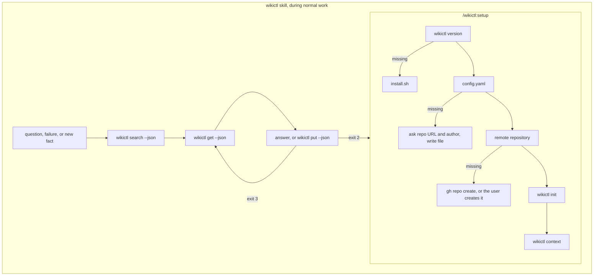

# wikictl-claude-plugin

[日本語版](README.ja.md)

A Claude Code plugin that lets Claude read and record knowledge in a Markdown wiki through [wikictl](https://github.com/roamer7038/wikictl). It contains two skills and nothing else: no hooks, no MCP server, no scripts.

## Install

Inside Claude Code:

    /plugin marketplace add roamer7038/wikictl-claude-plugin
    /plugin install wikictl@wikictl-claude-plugin

Then run `/wikictl:setup` once. For local development: `claude --plugin-dir /path/to/wikictl-claude-plugin`.

Verified with wikictl v0.1.0.

## Structure

```
.claude-plugin/
  plugin.json          plugin manifest
  marketplace.json     marketplace manifest (this repository is its own marketplace)
skills/
  wikictl/SKILL.md     read and record pages; Claude invokes it on its own
  setup/SKILL.md       install wikictl, write the config, create the wiki; run as /wikictl:setup
```

## Flow



## Skills

### wikictl

Tells Claude when to consult the wiki and how to read and write pages:

- Read before answering with environment-specific values, past decisions or rules, when a command fails, and before writing a new page.
- Write when work yields a reusable fact. Conversation summaries, standing instructions (CLAUDE.md) and procedures (skills) are not recorded.
- Update an existing page with `put --base <sha>`; on exit code 3 re-read the page and reapply the change.
- Place pages in `global/`, `projects/<name>/` or `machines/<name>/`, preferring the narrower one.

Format details are delegated to `wikictl help` and the wikictl README; the skill repeats only what Claude needs to decide.

### setup

Walks through installation in order, skipping steps whose check already passes: the binary (`install.sh` from the wikictl releases), `~/.config/wikictl/config.yaml` (repository URL and an author such as `claude-code@<hostname>`), the remote repository (`gh repo create` when available), `wikictl init`, and a final `wikictl context`. Each step that installs, writes or pushes is confirmed with the user. Pass the repository URL as an argument to skip the question: `/wikictl:setup git@github.com:you/wiki.git`.

## License

[MIT](LICENSE)
